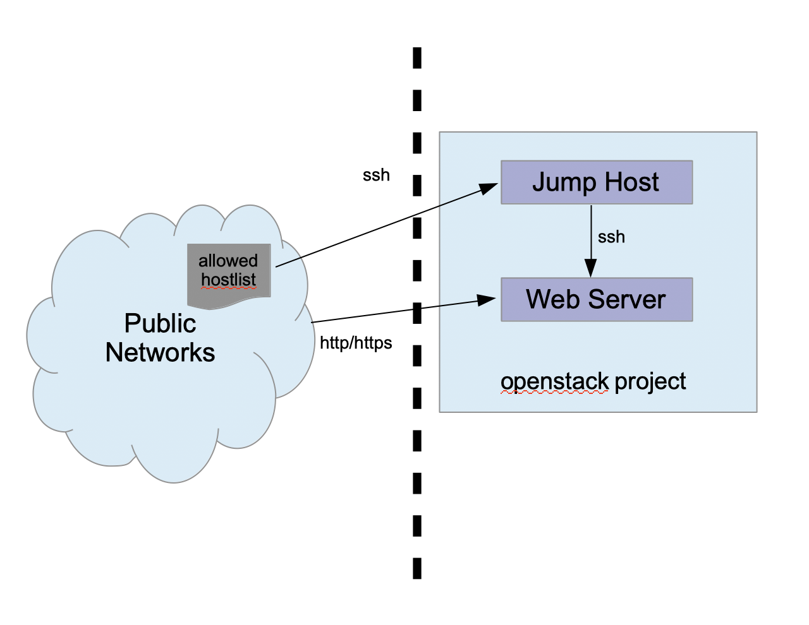

# Overview

This repository includes Ansible and Terraform templates to create a primitive
bastion host and a web server. These hosts are very basic in their
configuration.

* !! Use at own risk. None of these scripts have been tested !!
* No customization is done. Any specific web or host settings will need
  to be added.

# Configuration

## Bastion/jumphost
This host should:
 * Allow ssh from the Internet from specific IP addresses or CIDRs (allowlist) [TODO]
 
## Web VM
This host should:
* Allow ssh connections from the bastion instance on its private IP only. [TODO]
* Have httpd installed.
* Allow connections on port 80/443 from the Internet using default SSL certs
 
# Procedures
1. [Provision instance(s) using Terraform](tf/README.md)
2. [Run Ansible playbook(s) to finish host configuration(s)](ansible/README.md)

# Future Considerations

* If this configuration is meant to be fault tolerant/highly available perhaps
  consider:
  - Use a load balancer and consider using docker/Kubernetes to scale up/down
    as load changes.
  - Add monitoring and automation to address predictable problems.
  - Perhaps have a canary/test environment for service update testing.
  - If not using a container environment, consider creating a nanny service
    to automatically provision/decommission VM instances given predictable
    load indicators.

* Making this deployment more secure:
  - Use a firewall service at the network entry point to avoid needing to 
    maintain multiple firewall on a host-level basis
  - Regular security scans to probe vulnerabilities
  - Patch and update on a regular basis. This may include spinning
    up new instances with new OS images instead of patching in place.

* Balance cost and availability:
  - Use monitoring and automation where possible to collect usage data
    to help predict load surges and lulls, provisioning or removing 
    services as needed.

